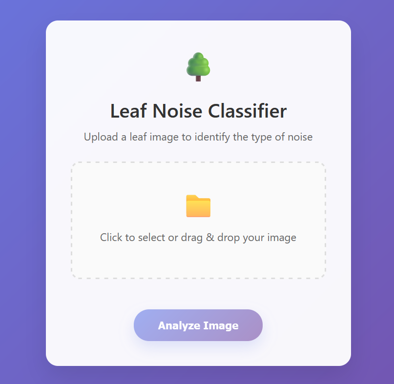

# Leaf Noise Classifier

A FastAPI application that classifies different types of noise in leaf images using a fine-tuned ResNet50 model.



## Features

- Upload leaf images via web interface
- Classify 17 different types of noise patterns
- Beautiful, responsive web UI with drag & drop
- Fully dockerized for easy deployment

## Quick Start with Docker

### Prerequisites
- Docker and Docker Compose installed on your machine

### Running the Application

1. **Clone the repository:**
   ```bash
   git clone https://github.com/AmirHossienAfshar/cv-noise-denoise.git
   cd leaf-noise-classifier
   ```

2. **Run with Docker Compose (easiest):**
   ```bash
   docker-compose up --build
   ```

3. **Or run with Docker directly:**
   ```bash
   # Build the image
   docker build -t leaf-classifier .
   
   # Run the container
   docker run -p 8000:8000 leaf-classifier
   ```

4. **Access the application:**
   Open your browser and go to `http://localhost:8000`

---

## Development Setup

If you want to run without Docker:

1. **Install dependencies:**
   ```bash
   pip install -r requirements.txt
   ```

2. **Run the application:**
   ```bash
   uvicorn app.main:app --reload
   ```
---

## About the Model

This model is a fine-tuned **ResNet50** designed to classify **17 different noise conditions** applied to leaf images. The objective is not to classify the leaf species, but rather to identify the type of noise present in the image.

### Noise Types (17 Classes)

**Single Noise Types**
1. Gaussian noise  
2. Salt & Pepper noise  
3. Poisson noise  
4. Speckle noise  
5. Uniform noise  

**Combinations of Two Noise Types**
6. Gaussian + Salt & Pepper  
7. Gaussian + Poisson  
8. Gaussian + Speckle  
9. Gaussian + Uniform  
10. Salt & Pepper + Speckle  
11. Salt & Pepper + Uniform  
12. Poisson + Speckle  
13. Poisson + Uniform  
14. Speckle + Uniform  

**Other Classes**
15. gaussian + salt & pepper + speckle 
16. gaussian + poisson + uniform 
17. salt & pepper + speckle + uniform

---

### Dataset

- **Base dataset:** [Leaf Detection Dataset (Kaggle)](https://www.kaggle.com/datasets/alexo98/leaf-detection)  
- The original dataset consists of **leaf images from 10 species of Indian trees**.  

### Preprocessing & Customization
1. **Ignore species labels:** All leaves are treated as one general "leaf" class.  
2. **Noise injection:** Custom noise functions were applied to simulate real-world image degradation:
   - `add_gaussian_noise`
   - `add_salt_pepper_noise`
   - `add_poisson_noise`
   - `add_speckle_noise`
   - `add_uniform_noise`
   - and combinations of these (e.g., Gaussian + Salt & Pepper).
3. **Final dataset:** Each image is labeled by **type of noise applied**, creating **17 distinct noise classes**.

#### how to prepair the dataset
The dataset on by itself, doesn't match the perpose of this project, so there should be modifications and preprocessing done.
to acheave that, you could follow the `00_download_and_prepare_data.ipynb` and `generate_noisy_images.ipynb` files.

---

### Training Details

- **Base model:** `ResNet50_Weights.IMAGENET1K_V1`  
- **Fine-tuning strategy:**
  - All layers frozen except the last residual block (`layer4`) and the final classifier (`fc`).  
  - The final `fc` layer replaced with a `Linear(in_features, 17)` classifier.  
- **Input resolution:** 224 × 224 (standard for ResNet50)  
- **Loss function:** CrossEntropyLoss  
- **Optimizer:** Adam (customizable)

---

### Fine-Tuned ResNet50 Inference Helper

This project provides a lightweight way to use a fine-tuned ResNet50 without uploading the entire model checkpoint. Only the *fine-tuned differences* (`resnet50_finetune_diff.pth`) are stored in this repository, while the base model weights are pulled from TorchVision (or optionally loaded from your own local checkpoint).

#### How It Works
- **Base model:** Standard `ResNet50_Weights.IMAGENET1K_V1` from TorchVision (or your own `.pth`).
- **Diff file:** Contains only the parameters that were fine-tuned (much smaller file).
- At runtime, the script:
  1. Loads the base model.
  2. Adjusts the final classification layer for your dataset (17 classes).
  3. Downloads and applies the diff weights.
  4. Returns a ready-to-use model for inference.


#### Quick Start on inference

##### 1. Open the inference notebook
```bash
jupyter notebook inference_helper.ipynb
```

##### 2. Use the Helper Function

The key function is `load_finetuned_resnet50`, which will handle everything automatically:

```python
from inference_helper import load_finetuned_resnet50

# Load fine-tuned ResNet50 (downloads diff if not present)
model = load_finetuned_resnet50()
model.eval()
```


##### Optional: Provide Your Own Base Model

If you already have a base ResNet50 `.pth` (e.g., custom pretraining):

```python
model = load_finetuned_resnet50(
    base_model_path="path/to/your/base_model.pth"
)
```

This bypasses downloading TorchVision weights.


#### Where is the Diff File?
- Stored in this repo as `resnet50_finetune_diff.pth`.
- If missing locally, the helper automatically downloads it from:
```
https://raw.githubusercontent.com/AmirHossienAfshar/cv-noise-denoise/master/saved_models/resnet50_finetune_diff.pth
```

---